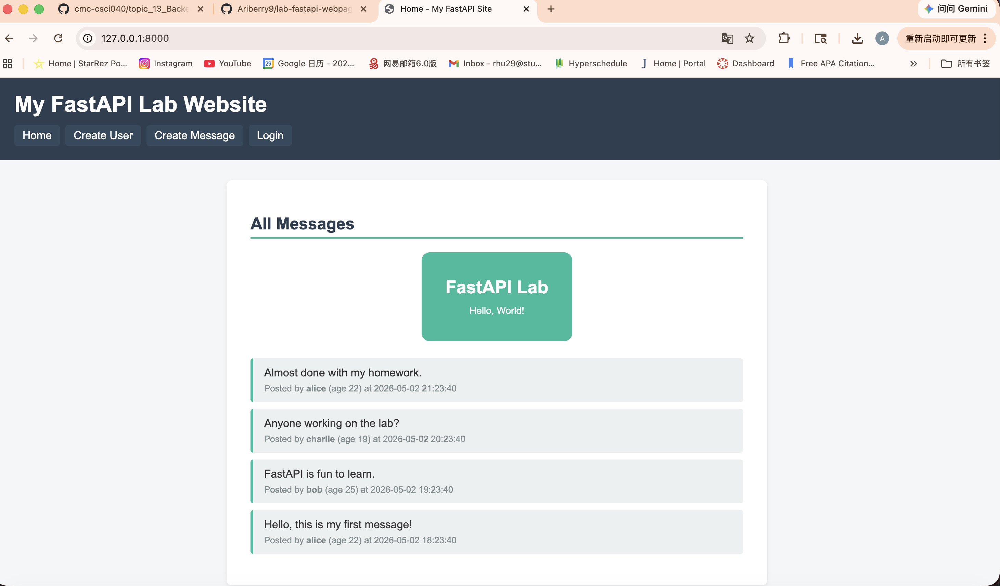

# FastAPI Lab Project

A FastAPI lab project — a small Twitter-clone implementing the 5 required
tasks plus a curated set of optional extensions (3-point: 1/2/3/4/5/6/7/8/9/10,
6-point: 1/2/4/8 with FTS5 +2 EC).

## Features

### Required (5 × 5 = 25 pts)
- **Home (`/`)** — paginated newest-first message feed. Always shown in the menu.
- **Log in (`/login`)** — username + `type="password"` form; identical error
  message for unknown user or wrong password to avoid information leaks.
- **Log out (`/logout`)** — clears the session cookie set at login.
- **Sign up (`/create_user`)** — username + age + password + confirm password;
  duplicate username and password-mismatch errors. On success the new user is
  auto-logged in and redirected to `/` (3-point task #7).
- **Post a message (`/create_message`)** — logged-in users only; stores
  `user_id` and `timestamp`; the new message shows up on `/` immediately.

### Optional 3-point tasks
- **#1 Themed CSS** — modern card/header/avatar styling in `static/style.css`.
- **#2 Auto-linkify URLs** — bare URLs become `<a>` via `bleach.linkify`.
- **#3 Bulk seed** — `db_create.py` inserts **200 users × 200 messages = 40,000**
  random messages, including one fixture with both `'` and `"` (required 1.v).
- **#4 Delete a message** — only by the author; 404 otherwise.
- **#5 Edit a message** — only by the author; the home / profile pages show an
  `edited at YYYY-MM-DD HH:MM:SS` tag for edited messages.
- **#6 Delete user account** — `/account/delete` requires the current password
  AND typing `DELETE` to confirm; cascades through the user's messages (FTS5
  index stays in sync via the `messages_ad` trigger) and removes the avatar
  PNG from disk in a single transaction.
- **#7 Auto-login on sign-up** — see Required above.
- **#8 Change password** — `/account/password` requires the user to type their
  old password plus the new one twice. New password must be ≥6 characters and
  different from the current one. Stored as a fresh bcrypt hash.
- **#9 Unique avatar per user** — robohash kitten set (`set=set4`) downloaded
  once into `static/avatars/<username>.png` so requests are served entirely
  locally afterwards. Falls back to `_default.png` on download errors.
- **#10 JSON feed** — `GET /messages.json` returns the same data as `/` in
  JSON form (paginated).

### Optional 6-point tasks
- **#1 Pagination** — 50 messages per page on `/` with previous/next buttons;
  uses SQL `LIMIT` + `OFFSET` for efficiency.
- **#2 User profile pages** — `/users/<username>` (public, anyone can view)
  shows the user's avatar, age, bio and 50 most recent messages.
  Profile owners can edit their bio at `/profile/edit`.
- **#4 Full-text search** — `/search?q=...` powered by **SQLite FTS5** (the
  `messages_fts` virtual table is kept in sync via triggers) for the +2 EC.
- **#8 Markdown support** — message bodies are parsed by `markdown` and then
  passed through `bleach.clean` with a strict allow-list before rendering.

### Security
- Every SQL statement uses parameterised queries (no string concatenation).
- Jinja2 autoescape is on; user-supplied HTML is never marked safe unless it
  has been sanitised by `render_message_html` (markdown → bleach).
- Edit / delete routes check that the logged-in user owns the message.
- Invalid path / query parameters return 4xx (typically 404), never 500.
- Passwords are stored with bcrypt.

## Project Structure

```
fastapi项目扩展/
├── app.py              # FastAPI routes (12 total) and helpers
├── db_create.py        # Builds site.db, seeds 200×200 messages, downloads avatars
├── avatar.py           # Concurrent robohash kitten downloader + fallback
├── requirements.txt
├── 任务清单.md          # Task checklist (Chinese)
├── README.md
├── site.db             # SQLite database (created by db_create.py)
├── templates/
│   ├── base.html              # Shared shell + nav + flashes + footer
│   ├── index.html             # Paginated message feed
│   ├── login.html             # Username + password form
│   ├── logout.html            # Logout confirmation
│   ├── create_user.html       # Sign-up form (password + confirm)
│   ├── create_message.html    # Post a new message (Markdown hint)
│   ├── edit_message.html      # Edit your own message
│   ├── user_profile.html      # Public profile + recent 50 messages
│   ├── profile_edit.html      # Edit your own bio + Account settings links
│   ├── change_password.html   # Old password + new password (×2) form
│   ├── delete_account.html    # Password + DELETE confirmation form
│   └── search.html            # FTS5 search form + results
└── static/
    ├── style.css
    ├── logo.svg
    ├── screenshot.png
    └── avatars/               # 200 per-user kitten PNGs + _default.png
        ├── alice.png
        ├── bob.png
        └── ...
```

## Routes

| Method | Path | Purpose |
| --- | --- | --- |
| GET | `/` | Paginated message feed (50/page) |
| GET / POST | `/login` | Username + password login |
| GET | `/logout` | Clear session |
| GET / POST | `/create_user` | Sign up + auto-login |
| GET / POST | `/create_message` | Post a new message |
| GET / POST | `/messages/{id}/edit` | Edit one of your messages |
| POST | `/messages/{id}/delete` | Delete one of your messages |
| GET | `/messages.json` | JSON feed of the same data |
| GET | `/users/{username}` | Public profile + recent 50 messages |
| GET / POST | `/profile/edit` | Edit your own bio |
| GET / POST | `/account/password` | Change your password (old + new ×2) |
| GET / POST | `/account/delete` | Delete your account + cascade messages/avatar |
| GET | `/search?q=...` | FTS5 full-text search |

## How to Run

1. Install dependencies (`bcrypt`, `markdown`, `bleach`, FastAPI etc.):

   ```bash
   pip install -r requirements.txt
   ```

2. Create the database AND download every user's kitten avatar.
   This is a one-time step; it only needs to run again if you want fresh
   sample data. The database insert finishes in ~2 seconds; the avatar
   downloads take a few minutes (12-way concurrent, with retries; any
   failure falls back to `_default.png` so no avatar is ever missing).

   ```bash
   python db_create.py
   ```

3. Start the FastAPI development server (either command works):

   ```bash
   # Option A: run via uvicorn (recommended for auto-reload)
   uvicorn app:app --reload

   # Option B: run the script directly
   python app.py
   ```

4. Open your browser and visit `http://127.0.0.1:8000/`.

## Usage

Test accounts (all share the password **`password`**):

- `alice`, `bob`, `charlie`, `quote_tester`
- `user001` … `user196`

Walk-through:

1. Open `/` — paginated feed with 40,000 seeded messages and one fixture
   containing both `'` and `"` on the first page (quote_tester's post).
2. Try `/login` with e.g. `alice` / `password`, or `/create_user` to make a
   new account (which is auto-logged-in on success).
3. While logged in: click `Post`, write Markdown — try `**bold**`, an inline
   URL like `https://example.com`, or `> a quote`. Submit and you'll land
   back on `/` with your message at the top.
4. Click any username to view their profile. Your own profile has an
   `Edit profile` button.
5. Try `/search?q=fastapi` — full-text search via SQLite FTS5.
6. Open `/messages.json` to see the JSON feed (handy for scripting).
7. On the home page, each message you authored has `Edit` / `Delete`
   buttons; edited messages get an `edited at ...` tag.
8. Visit `/profile/edit` and scroll to **Account settings** to either
   `Change password` (old password + new password twice) or
   `Delete my account` (requires your password and typing `DELETE`).
   Deleting an account also removes every message that user posted and
   the per-user avatar PNG; the FTS5 index stays in sync via a trigger.

## Screenshot



## Submission Notes

1. Make sure `static/avatars/` and `site.db` are committed (or rebuilt by
   re-running `python db_create.py`) so the lab-submission branch is
   self-contained.
2. Add a screenshot of the working `/` route to this README.
3. Create a new branch named `lab-submission` containing all of the lab code.
4. Submit the link to that branch on Canvas.
5. Do **not** modify the `lab-submission` branch after submitting; continue
   any further work on the `main` / `master` branch.
